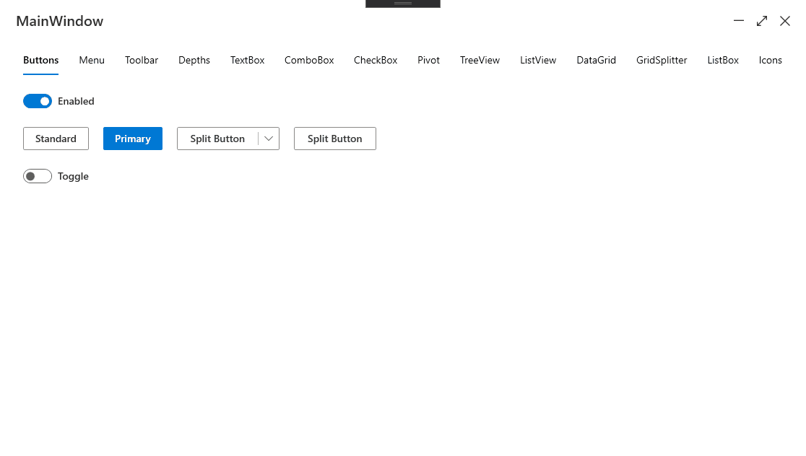

# Fluent UI for WPF (.NET Core 3.0+ and .NET 4.7.2+)
Office Fabric UI (https://developer.microsoft.com/en-us/fluentui#/) WPF theme library

 

# Install
- .NET Core 3.0+

  `Install-Package OfficeFabricUI`
- .NET 4.7.2+  

  `Install-Package OfficeFabricUI.NET`

# Showcase

